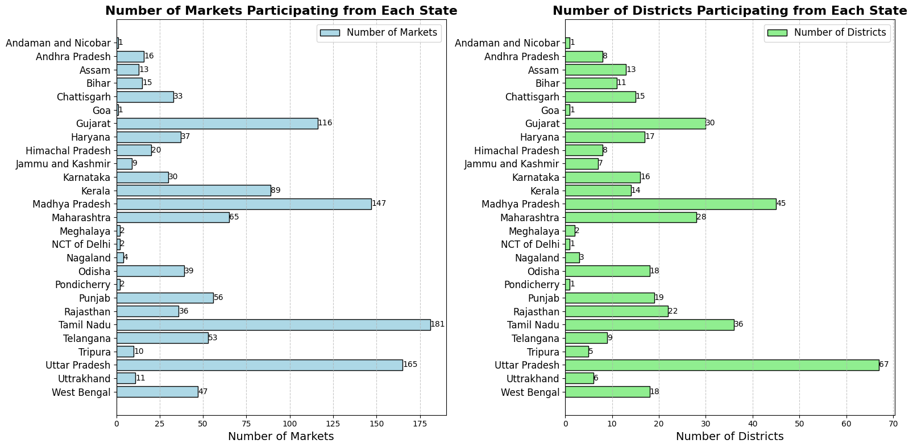

# Analysis of Daily Price of Various Commodities from Various Markets (Mandi)

## Table of Contents
- [Overview](#overview)
- [Dataset](#dataset)
- [Features](#features)
- [Visualizations](#visualizations)
- [Contributing](#contributing)
- [License](#license)

## Overview
This report analyzes the current state of agricultural commodities in India, utilizing data sourced from the Current Daily Price of Various Commodities from Various Markets (Mandi) dataset available on 
https://www.data.gov.in/catalog/current-daily-price-various-commodities-various-markets-mandi. With a focus on price trends, trade volumes, and market shares across different states, the report aims to 
provide valuable insights into the dynamics of agricultural markets in the country. By examining key indicators such as minimum trade prices, average modal prices, distinct commodity counts, and market 
shares, the report seeks to highlight the disparities and opportunities present within the agricultural sector. Understanding these factors is crucial for policymakers, farmers, and market participants as they 
navigate the complexities of agricultural trade and strive for improved market efficiency and equity.

## Dataset
The dataset contains the following columns:
- **State**: The state in which the market is located.
- **District**: The district where the market is located.
- **Market**: The market name where commodity prices were recorded.
- **Commodity**: The name of the commodity (e.g., wheat, rice).
- **Variety**: The specific variety of the commodity.
- **Grade**: The grade or quality of the commodity.
- **Arrival_Date**: The date when the prices were recorded.
- **Min_x0020_Price**: The minimum price for the commodity on that day in the market.
- **Max_x0020_Price**: The maximum price for the commodity on that day in the market.
- **Modal_x0020_Price**: The most common price for the commodity on that day in the market (often used as a representative price).

## Features
- **Bar Chart**: Number of Markets and Districts present in different States.
- **Pie Chart**: Market Share Distribution by State.
- **Bubble Chart**: Distinct Commodities Count and Average Minimum price by State.
- **Line Chart**: Grade Count Accross Different Grades and Average Modal price by State.
- **Scatter Plot**: Commodity and Market Distribution by State.
- **India's Political Map**: Market's Districts on India's Map.

## Visualizations
Here are the visualizations that analyse the Mandi dataset for this project:

- 

- **Heatmap**: Visualize the variation of prices (e.g., modal prices) across states for specific commodities.
  

## Contributing
Contributions are welcome! To contribute:
1. Fork the repository.
2. Create a new branch (`git checkout -b feature/your-feature`).
3. Make your changes and commit (`git commit -m 'Add some feature'`).
4. Push to the branch (`git push origin feature/your-feature`).
5. Create a pull request.

For any questions or suggestions, feel free to open an issue.

## License
This project is licensed under the MIT License - see the [LICENSE](LICENSE) file for details.
