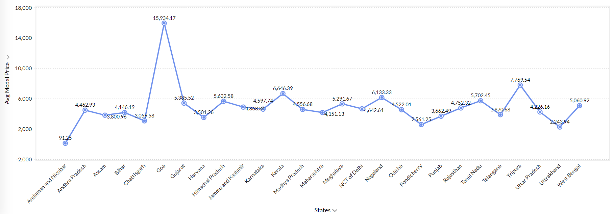

# Analysis of Daily Price of Various Commodities from Various Markets (Mandi)

## Table of Contents
- [Overview](#overview)
- [Dataset](#dataset)
- [Features](#features)
- [Visualizations](#visualizations)
- [Contributing](#contributing)
- [License](#license)

## Overview
This report analyzes the current state of agricultural commodities in India, utilizing data sourced from the Current Daily Price of Various Commodities from Various Markets (Mandi) dataset available on 
https://www.data.gov.in/catalog/current-daily-price-various-commodities-various-markets-mandi. With a focus on price trends, trade volumes, and market shares across different states, the report aims to 
provide valuable insights into the dynamics of agricultural markets in the country. By examining key indicators such as minimum trade prices, average modal prices, distinct commodity counts, and market 
shares, the report seeks to highlight the disparities and opportunities present within the agricultural sector. Understanding these factors is crucial for policymakers, farmers, and market participants as they 
navigate the complexities of agricultural trade and strive for improved market efficiency and equity.

## Dataset
The dataset contains the following columns:
- **State**: The state in which the market is located.
- **District**: The district where the market is located.
- **Market**: The market name where commodity prices were recorded.
- **Commodity**: The name of the commodity (e.g., wheat, rice).
- **Variety**: The specific variety of the commodity.
- **Grade**: The grade or quality of the commodity.
- **Arrival_Date**: The date when the prices were recorded.
- **Min_x0020_Price**: The minimum price for the commodity on that day in the market.
- **Max_x0020_Price**: The maximum price for the commodity on that day in the market.
- **Modal_x0020_Price**: The most common price for the commodity on that day in the market (often used as a representative price).

## Features
- **Bar Chart**: Number of Markets and Districts present in different States.
- **Pie Chart**: Market Share Distribution by State.
- **Bubble Chart**: Distinct Commodities Count and Average Minimum price by State.
- **Line Chart**: Grade Count Accross Different Grades and Average Modal price by State.
- **Scatter Plot**: Commodity and Market Distribution by State.
- **India's Political Map**: Market's Districts on India's Map.

## Visualizations
Here are the visualizations that analyse the Mandi dataset for this project:

- No. of Markets and Districts present in different States
  
  The first graph shows the distribution of market and district count by state. Tamil Nadu has maximum
number of markets followed by Uttar Pradesh and Madhya Pradesh and so on whereas Uttar Pradesh has
maximum no. of districts followed by Madhya Pradesh and Gujarat and so on.

- Market Share Distribution by State
  
  The second chart is a pie chart represent the contribution of each state in the market. Tamil Nadu dominates
the market with the largest share of 41.7%. Other states like Jammu & Kashmir, Andaman & Nicobar and
Uttarakhand contributes in the market, they have small shares but those too play a significant role in the
market capital.

- Distinct Commodities Count by State
  
  The third graph represents the distinct commodities count for various states. States like Gujarat, Karnataka,
and Uttar Pradesh show a high count of distinct commodities, indicating diverse agricultural production. In
contrast, states such as Assam and Nagaland show relatively lower counts. Himachal Pradesh shows an
unusually negative value, suggesting potential anomalies or missing data in the dataset. Size of bubble
represents the average maximum price for that state and commodity with count in y-axes. Bigger the size
means larger is the average value for that coordinate.

- Grade Count Across Different Grades
  
  The fourth graph presents the count of commodities categorized by their grades. FAQ (Fair Average
Quality) and Local grades are the most common, with the largest number of commodities falling into these
categories, especially FAQ with over 7,000 entries. On the other hand, large and small grades have much
fewer entries, with small grade commodities barely represented in the dataset.

- Commodity and Market Distribution by State
  
  The fifth chart illustrates the distinct count of commodities and markets across various Indian states. The
blue circles represent the distinct count of commodities, while the green circles represent the distinct count
of markets in each state. States like Maharashtra, Telangana, and Uttar Pradesh have the highest number of
both distinct commodities and markets, indicating a broader variety and distribution network. On the other
hand, smaller regions like Andaman and Nicobar, Goa, and Nagaland show significantly fewer distinct
commodities and markets. Some states, like Andhra Pradesh and Tamil Nadu, display a more balanced
representation between commodities and markets, whereas others like Maharashtra and Telangana show
more distinct commodities than markets.

- Average modal price by state
  
  The sixth chart is a line graph showing the average modal price across various states. The Y-axis represents the
average modal price, and the peaks and troughs indicate the fluctuations. Goa shows the highest average modal price,
while Andaman and Nicobar Islands have the lowest. States like Telangana, Uttar Pradesh, and Maharashtra also
show significant average prices, while others like Bihar and Madhya Pradesh remain relatively moderate.

- Average Minimum price by state
  
  The seventh chart is a bubble chart that shows the minimum trade price of commodities across various
Indian states. The size of the bubbles indicates the volume of trades, while the Y-axis displays the minimum
trade price. States like Telangana, Tamil Nadu, and Maharashtra exhibit the largest bubble sizes, indicating
higher trade volumes, while some other states like Goa and Jammu & Kashmir have relatively smaller trade
volumes but higher minimum prices.
  
- Market Districts on India’s Map
  
  The final map visualization highlights the geographic distribution of districts in which markets are present
across India. The map shows dense coverage in northern and western parts of the country, including Uttar
Pradesh, Madhya Pradesh, and Rajasthan. The southern and northeastern regions have sparser market
district coverage, indicating regional disparities in market distribution.

## Contributing
Contributions are welcome! To contribute:
1. Fork the repository.
2. Create a new branch (`git checkout -b feature/your-feature`).
3. Make your changes and commit (`git commit -m 'Add some feature'`).
4. Push to the branch (`git push origin feature/your-feature`).
5. Create a pull request.

For any questions or suggestions, feel free to open an issue.

## License
This project is licensed under the MIT License - see the [LICENSE](LICENSE) file for details.
